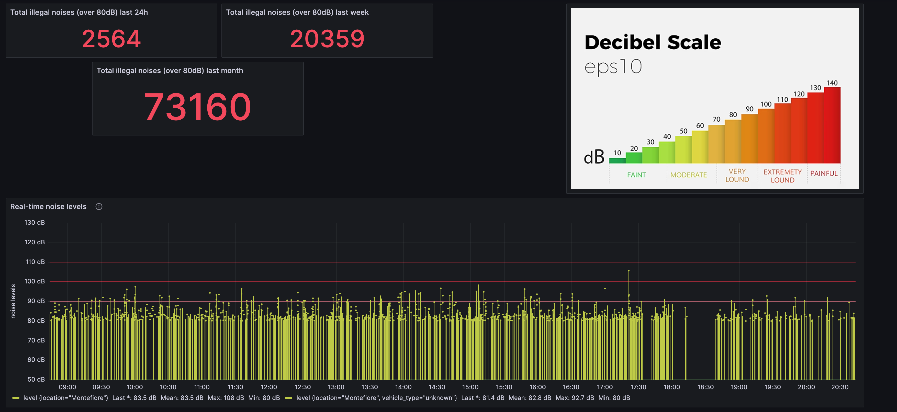
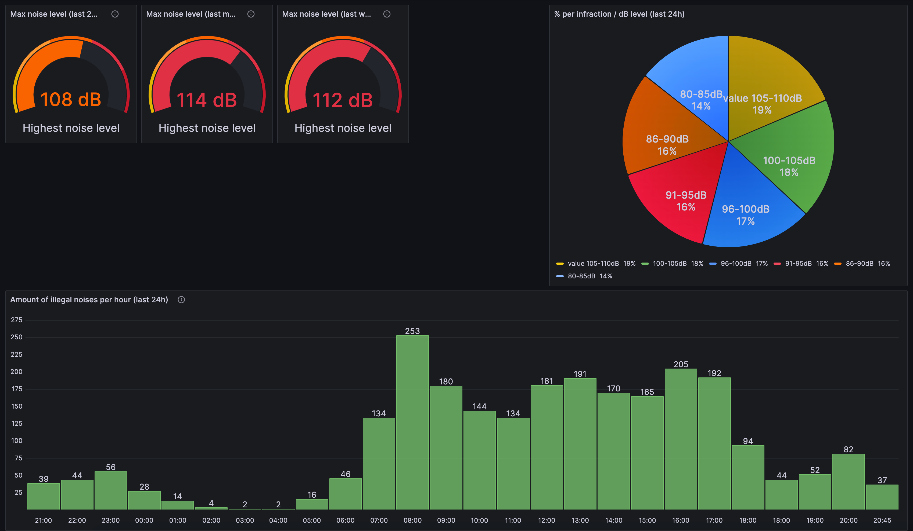

# NoiseBuster

NoiseBuster is a simple Python script that utilizes the USB library to interact with a sound meter device and catalog the recorded noise events. The script provides basic functionalities for managing and monitoring noise levels.





## Features

- Noise Recording: The script interfaces with a compatible sound meter device connected via USB and records noise events, capturing information such as noise levels and timestamps.

- Data Storage: Recorded noise events are stored locally in a structured format, allowing easy retrieval and analysis of noise data. The script includes the required influxDB modules to allow you to inject the events in your own influxDB. 

## Usages

- Monitor loud traffic, planes, live events, ...
- Create nice graphics in order to share visually attractive statistics with authorities

## Getting Started

### Prerequisites

Before using NoiseBuster, ensure the following prerequisites are met:

- Python 3.x is installed on your system.
- The necessary Python dependencies are installed. See the `requirements.txt` file for a list of dependencies.
- Optional (but you want this) -> make sure you have a running instance of influxDB 2.x, and created a bucket dedicated to the noise monitoring), in order to get a plug and play script, you can simply create a bucket names "noise_buster" and a bucket names "noise_buster", create an api KEY, that you will then paste inside the script configuration. 
- Optional -> the script includes a pushover module, allowing you to get notified when the script starts and connects to influxDB

### Installation

1. Clone the NoiseBuster repository from GitHub using the following command : git clone https://github.com/your-username/noise_buster.git
2. Install a recent version of setuptools as older versions prevents to successfully install dependencies: pip install -r setuptools.txt
3. Install the requirements : pip install -r requirements.txt

### Docker container

The script can be run from a docker container, but the script still needs to be adapted in order to write to your own influxDB instance and/or push the messages to your own pushover account. 

If you decide to run this toold from within docker, simply follow the bellow configuration steps (Configuration category) and run : 

````
docker build -t noise_buster . 
````

The USB device needs to be passed to the docker container, in order to do this, proceed as follow : 

1. list your USB device using lsusb command
2. check the results and find your usb device. It should have a bus and device number, as shown in below example: 
````
Bus 003 Device 011: ID 16c0:05dc Van Ooijen Technische Informatica shared ID for use with libusb
````
3. run the docker like this (and add your own Bus and Device IDs :
````
docker run -d --name noise_buster --device=/dev/bus/usb/003/011 noise_buster
````

### Configuration

Before running the script, you need to configure the necessary information. Open the `noise_buster.py` file in a text editor and locate the following section:

```
# InfluxDB connection information
influxdb_host = "127.0.0.1"  # Set the InfluxDB host address (e.g., "192.168.194.240")
influxdb_port = 8086  # Set the InfluxDB port (default: 8086)
influxdb_token = "your_api_key_comes_here"  # Set the InfluxDB token (within double quotes)
influxdb_org = "noise_buster"  # Set the InfluxDB organization name (e.g., "noise_buster")
influxdb_bucket = "noise_buster"  # Set the InfluxDB bucket name (e.g., "noise_buster")
influxdb_timeout = 20000  # Set the InfluxDB timeout value in milliseconds (value is in milliseconds, try a higher value if you encounter timeouts) (e.g., 20000)

# Pushover connection information (Optional) (comment if not wanted)
pushover_user_key = "pushover_user_key"  # Set the Pushover user key (within double quotes) or leave empty to skip Pushover notifications
pushover_api_token = "pushover_api_token"  # Set the Pushover API token (within double quotes) or leave empty to skip Pushover notifications

# Minimum noise level for logging events
minimum_noise_level = 80  # Set the minimum noise level for logging events (e.g., 80)

# Content of messages sent by Pushover (comment if you do not use pushover or don't want notifications to be sent)
pushover_message = "Lets bust these noise events"  # Set the content of the Pushover message (within double quotes)
pushover_title = "Noise Buster"  # Set the title of the Pushover message (within double quotes)

# Message to display when starting the script
start_message = "Lets bust these noise events"  # Set the start message to display (within double quotes)

# InfluxDB measurement and location
influxdb_measurement = "noise_buster_events"  # Set the InfluxDB measurement name (within double quotes)
influxdb_location = "noise_buster"  # Set the location for InfluxDB measurement (within double quotes)
````

### Running the script
1. connect your USB monitoring device to your computer (yes, I had to write this down)
2. execute the script : python noise_buster.py

From now on, you should be able to query your influxDB and see the noise events coming in ! 

### Tips and tricks
- You can easily check if the script is recording events by simply runing it and start screaming (be creative, scream something funny). As soon the dB level you configured will be reached, you'll see events like this showing up : 
````
2023-06-16 12:55:58,883 - INFO - 2023-06-16T10:55:58Z, 89.1 dB
````

- For some reason, the script is not running outside of a venv on my end. If this is also happening to you, try the following : 
```
python3 -m pip install --user virtualenv
python3 -m venv env
source env/bin/activate
pip install -r setuptools.txt && pip install -r requirements.txt
python noise_buster.py
````
### InfluxDB queries

The nice looking graphs you can see in the above screenshots are generated by querying InfluxDB. The following grafana template should work out of the box if you kept "influxdb_measurement = "noise_buster_events"" and "influxdb_location = "noise_buster" in the script settings.

Here is a link to the public demo dashboard : https://grafana.phospho.ovh/public-dashboards/9e3780a1b50245cc9ae831fda4cb75b4?orgId=1&refresh=5s

Simply import the grafana_noisebuster.json file to your grafana dashboard to start monitoring your evens in no time! :) 

### Hardware

This is the volume meter I bought on aliexpress, I did not test any other device, but I am quite confident any usb enabled sound meter should do the trick as soon it has a usb port : 
https://www.aliexpress.com/item/32995118902.html?spm=a2g0o.order_list.order_list_main.58.69741802WqDA8t

### Contributing
Contributions to noise_buster.py are welcome! If you encounter issues, have suggestions, or would like to add new features, please submit an issue or create a pull request on the GitHub repository.

### Next steps
- I am trying to add openCV vehicle detection to this script, this to put a vehicle type on each noise event reported to Influx. 
- ???

### License
This project is licensed under the GNU License. 

### Project
The initial project is a project by Raphael Vael


