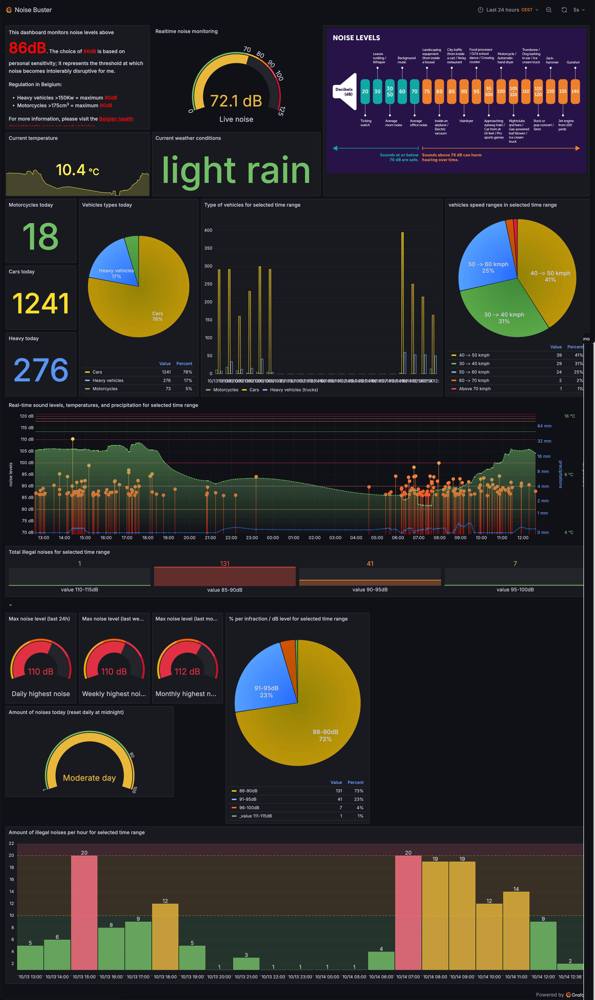
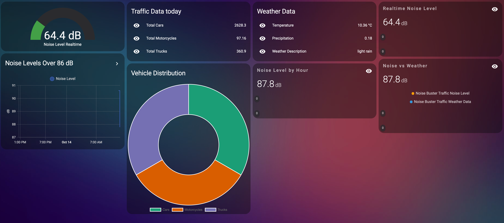

NoiseBuster is an advanced Python application designed to monitor and log noise levels using a USB-connected sound meter. It not only records noise events but also integrates with various services like InfluxDB, MQTT, Discord, and more to provide a comprehensive noise monitoring solution. With features like weather data integration and traffic data collection, NoiseBuster offers a versatile tool for environmental monitoring and analysis.

## Live NoiseBuster Running Instance

**🚀 [Click here to see NoiseBuster in action!](https://nb-be-mont-1.noisebuster.ovh/public-dashboards/3f841065ea804f11847a85ebd5e0c0d5?orgId=1&refresh=5s)**

  
*NoiseBuster Dashboard in Grafana showing noise events over time.*

  
*Analysis of noise levels in Home Assistant.*

---

## Important Notice

**Note:** NoiseBuster is licensed under the [Creative Commons Attribution-NonCommercial (CC BY-NC) License](https://creativecommons.org/licenses/by-nc/4.0/), which means it is free for non-commercial use only. Commercial use requires explicit permission from the project owner.

## Discord Server

Join the community on our Discord server to discuss, contribute, and get support: [NoiseBuster Discord Server](https://discord.gg/pCxtsg7mBN)

## Features

- **Noise Monitoring:** Interfaces with a USB sound meter to monitor and record noise levels in real-time.
- **Data Storage:** Stores recorded noise events in InfluxDB for easy retrieval and analysis.
- **MQTT Integration (_Optional_):** Publishes noise levels and events to an MQTT broker for integration with home automation systems like Home Assistant.
- **Weather Data Collection (_Optional_):** Fetches current weather data from OpenWeatherMap API to correlate noise events with weather conditions.
- **Traffic Data Collection (_Optional_):** Integrates with Telraam API to collect traffic data, allowing analysis of noise levels in relation to traffic conditions. _Note: A dedicated YOLO-powered traffic counting script is in development and will be available soon._
- **Image Capture (_Optional_):** Captures images using an IP camera or Raspberry Pi camera when noise levels exceed a specified threshold.
- **Notifications (_Optional_):** Sends notifications via Discord and Pushover when certain events occur (e.g., high noise levels, API failures).
- **Configurable Timezone:** Adjusts timestamps according to the specified timezone offset.
- **Error Handling and Logging:** Robust error handling with detailed logging for troubleshooting.

## Usages

- Monitor loud traffic, planes, live events, and more.
- Create insightful graphics to share statistics with authorities.
- Analyze environmental noise in correlation with weather and traffic data.

## Getting Started

### Prerequisites

Before using NoiseBuster, ensure the following prerequisites are met:

- **Operating System:** Linux-based system (e.g., Ubuntu, Debian, Raspberry Pi OS).
- **Python:** Python 3.6 or higher installed.
- **Sound Meter:** A USB-connected sound level meter. All models with USB communication capabilities should work. Other types like RS485 models and ESP devices with calibrated microphones could be used but may require additional setup by the user.
- **Internet Connection:** Required for API integrations (e.g., OpenWeatherMap, Telraam).
- **Optional but Recommended:**
  - **InfluxDB 2.x and Grafana:** For data storage and visualization.
- **Optional:**
  - **MQTT Broker:** If you wish to publish data to an MQTT broker.
  - **Docker:** Installed for containerized deployment.

### Installation

1. **Clone the repository using Git:**

    ```bash
    git clone https://github.com/silkyclouds/NoiseBuster.git
    ```

2. **Navigate to the `NoiseBuster` directory:**

    ```bash
    cd NoiseBuster
    ```

3. **Build the Docker image:**

    ```bash
    docker build -t noisebuster .
    ```

4. **Run the Docker container:**

    ```bash
    docker run -d --name noisebuster -p 8086:8086 -p 3000:3000 noisebuster
    ```

    This will start the NoiseBuster container with InfluxDB and Grafana accessible on ports `8086` and `3000`, respectively.

### Hardware Recommendations

- **PoE Splitter:** If you want to power your device using PoE, consider using a [PoE Splitter](https://www.aliexpress.com/item/1005006375194025.html).
- **IP65 Box:** For outdoor usage of your volume meter, I recommend using an [IP65 box](https://www.aliexpress.com/item/1005005848967422.html) to protect the device.
- **Volume Meter:** I use this [USB volume meter](https://www.aliexpress.com/item/1005006419144001.html), which runs smoothly on a Raspberry Pi and is powered directly through USB.
- **Linux-Compatible Board:** Use a Raspberry Pi or any other board capable of running Linux.
- **Virtual Machines and Containers:** You can also run NoiseBuster in a VM, LXC, or other virtual environment, and simply pass through the USB volume meter, avoiding dedicated hardware.

### Hardware Requirements

- **USB Sound Meter:**
  - The application is designed to work with USB-connected sound level meters.
  - **Example Device:** [USB Sound Level Meter on AliExpress](https://fr.aliexpress.com/item/1005006973608966.html)
  - Ensure the device supports USB communication.
  - For devices not automatically detected, you may need to specify the USB vendor ID and product ID in the configuration. Use the `lsusb` command to find these IDs.

      
    *Search for this type of USB meter*

- **Camera (_Optional_):**
  - **IP Camera:** Supports RTSP or HTTP protocols. Provide the camera's URL in the configuration.
  - **Raspberry Pi Camera:** Connects directly to the Raspberry Pi. Requires the `picamera` library.

## Configuration

All configuration settings are stored in the `config.json` file. Here is how to set up your configuration:

1. **Open `config.json` in a text editor.**  
   Keep all default IP addresses as `localhost` or `127.0.0.1` to ensure it works out of the box.

2. **Configure each section:**

    - **InfluxDB Configuration:**
      - Set `"enabled": true` to store data in InfluxDB.
      - Provide your InfluxDB `host`, `port`, `token`, `org`, and `bucket` names.
      - Ensure you create buckets named `"noise_buster"` and `"noise_buster_realtime"`.
      - **API Keys:** Follow the [InfluxDB setup guide](https://docs.influxdata.com/influxdb/v2.0/get-started/) to create your organization, buckets, and API tokens.

    - **Pushover Configuration (_Optional_):**
      - Set `"enabled": true` to receive Pushover notifications.
      - Provide your `user_key` and `api_token`. Register at [Pushover](https://pushover.net/).

    - **Weather Configuration (_Optional_):**
      - Set `"enabled": true` to fetch weather data.
      - Provide your OpenWeatherMap `api_key` and `location`. Sign up at [OpenWeatherMap API](https://openweathermap.org/api).

    - **MQTT Configuration (_Optional_):**
      - Set `"enabled": true` to publish data to an MQTT broker.
      - Provide your MQTT `server`, `port`, `user`, and `password`. Learn more at [mqtt.org](https://mqtt.org/).

    - **Camera Configuration (_Optional_):**
      - Set `"use_ip_camera": true` or `"use_pi_camera": true` based on your setup.
      - If using an IP camera, provide the `ip_camera_url`.

    - **Device and Noise Monitoring Configuration:**
      - Specify the `device_name` for identification.
      - Set `minimum_noise_level` in decibels to trigger events.
      - Specify `image_save_path` where images will be stored.
      - If automatic USB detection fails, provide `usb_vendor_id` and `usb_product_id`. Use the `lsusb` command to find these IDs.

    - **Telraam API Configuration (_Optional_):**
      - Set `"enabled": true` to collect traffic data.
      - Provide your Telraam `api_key` and `segment_id`. More info at [Telraam](https://telraam.net/).

    - **Timezone Configuration:**
      - Set `timezone_offset` relative to UTC.

    - **Discord Configuration (_Optional_):**
      - Set `"enabled": true` to send notifications to Discord.
      - Provide your Discord `webhook_url`. Create one at [Discord Webhooks](https://support.discord.com/hc/en-us/articles/228383668-Intro-to-Webhooks).

3. **Save `config.json`.**

## Running the Script

### Using Docker (_Recommended_)

The easiest way to get started is by using Docker. A `docker-compose.yml` file is provided to set up all the necessary components.

1. **Ensure Docker and Docker Compose are installed on your system.**  
   Learn more at [Docker Installation](https://docs.docker.com/get-docker/).

2. **Navigate to the project directory:**

    ```bash
    cd NoiseBuster
    ```

3. **Edit the `docker-compose.yml` file if necessary.**

4. **Run Docker Compose:**

    ```bash
    docker-compose up -d
    ```

5. **Pass the USB device to the Docker container:**
    1. List your USB devices using the `lsusb` command.
    2. Identify your USB sound meter in the list.
    3. Note the Bus and Device IDs (e.g., Bus 003 Device 011).
    4. Modify the `devices` section in `docker-compose.yml` to include your device:

        ```yaml
        devices:
          - "/dev/bus/usb/003/011:/dev/bus/usb/003/011"
        ```

6. **Check the logs to ensure it's running correctly:**

    ```bash
    docker-compose logs -f
    ```

### Using Python Directly

1. **Ensure the USB sound meter is connected to your computer.**

2. **Activate the virtual environment if you created one:**

    ```bash
    source env/bin/activate
    ```

3. **Run the application:**

    ```bash
    python noisebuster.py
    ```

## License

This project is licensed under the [GNU GPLv3 License](LICENSE). This license allows for free usage and modification of the code for non-commercial purposes. For commercial use, explicit permission from the project owner is required. By choosing this option, I aim to encourage open-source collaboration while maintaining control over commercial applications of NoiseBuster.

## Contributing

1. **Fork the repository.**
2. **Create a new branch for your changes.**
3. **Submit a pull request with a detailed explanation of your changes.**

I'm actively developing a vehicle detection and counting module based on YOLOv11 to correlate noise events with specific vehicle types. If you're interested in helping improve this model or contributing in other ways, please reach out! Any contributions to the detection and accuracy of vehicle classification would be invaluable.

## Next Steps

- Adding vehicle detection using OpenCV to correlate noise events with specific vehicles.
- Providing a centralized InfluxDB instance for users to contribute data.
- Investigating other hardware options like ESP devices for sound monitoring.
- Implementing better data retention policies to manage database size.
- A dedicated YOLO-powered traffic counting script is in development and will be available soon.

## Project

This project was initiated by Raphael Vael. I welcome anyone interested in improving NoiseBuster to join the effort. Whether it's refining the vehicle detection model, optimizing the noise detection algorithms, or expanding functionality, your input is greatly valued!
